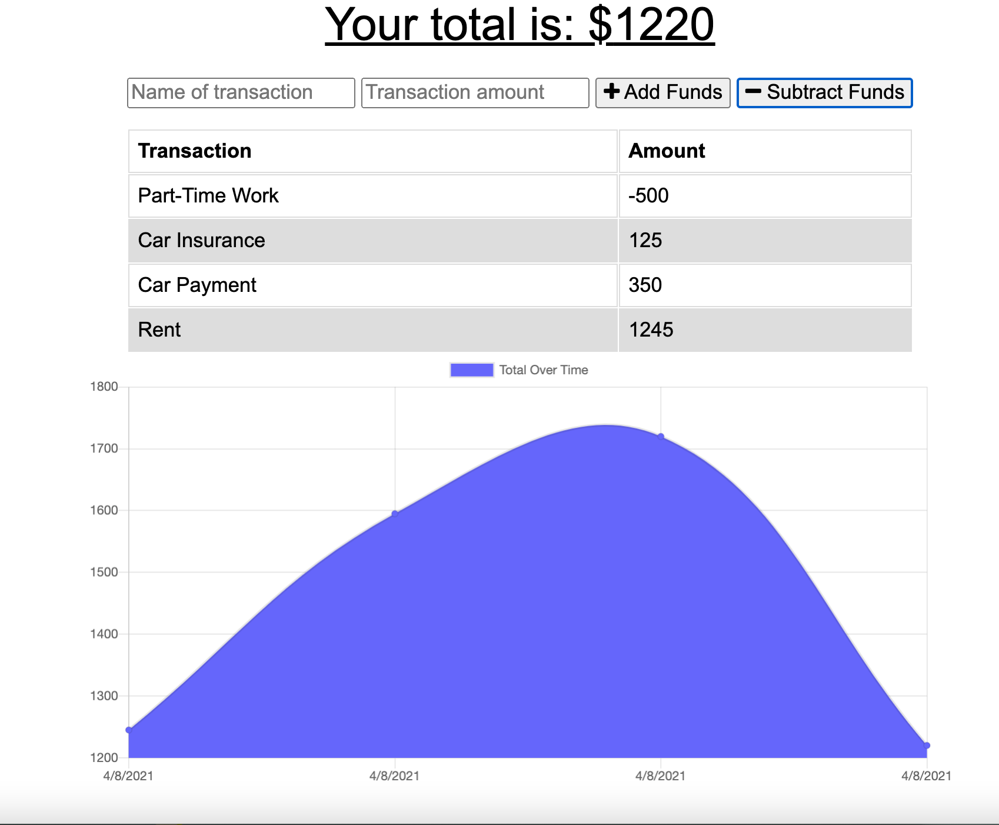

# Online-Offline-Budget-Tracker

## Description

   The user will be able to add expenses and deposits to their budget with or without a connection. When entering transactions offline, they should populate the total when brought back online.
---

    
## Table of Contents 
     
---
* [Installation](#Installation)
* [UserStory](#UserStory)
* [Usage](#Usage)
* [Credits](#Credits)
* [License](#License)
* [Questions](#Questions|Comments|Concerns)
    
---
## Installation

```npm compression, npm express, npm lite-server, npm mongoose, npm morgan```

---

## UserStory

AS AN avid traveller
I WANT to be able to track my withdrawals and deposits with or without a data/internet connection
SO THAT my account balance is accurate when I am traveling


---

## Usage 

Giving users a fast and easy way to track their money is important, but allowing them to access that information anytime is even more important. Having offline functionality is paramount to our applications success.

---


## Credits 

N/A

---


## License


---

## Questions|Comments|Concerns

https://github.com/imanid-code

imanidillahunt@gmail.com	
---
